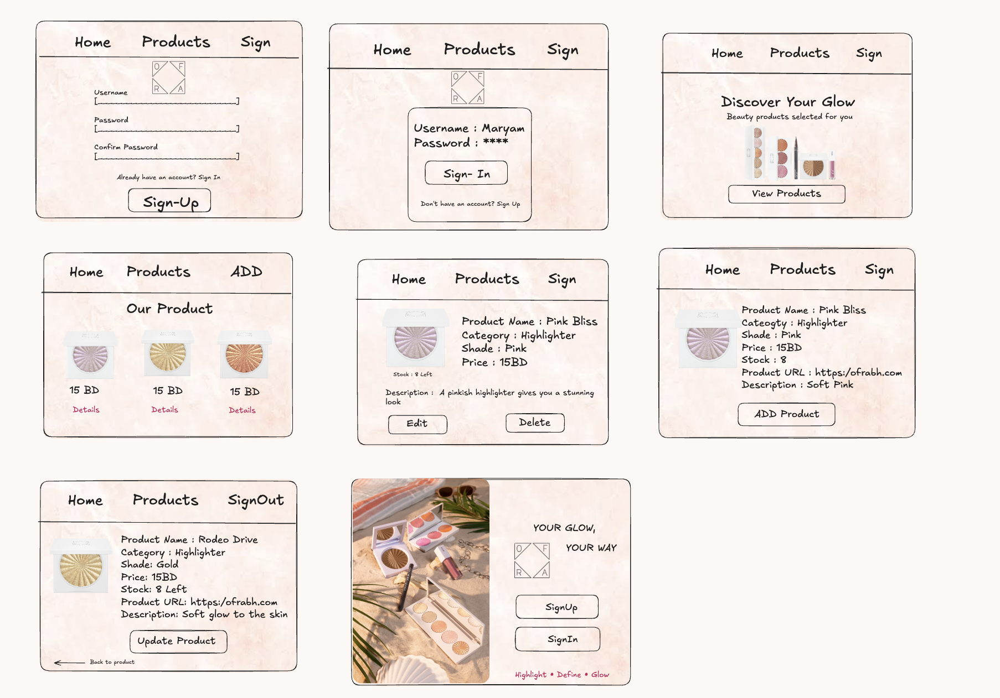
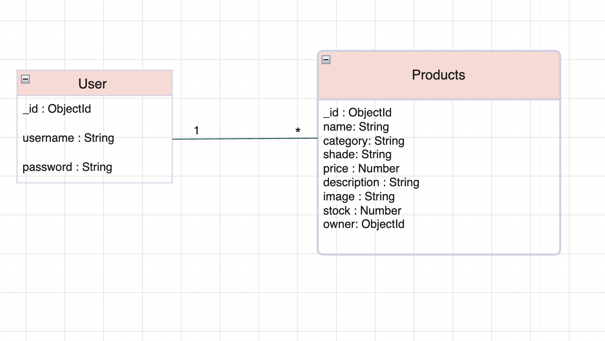
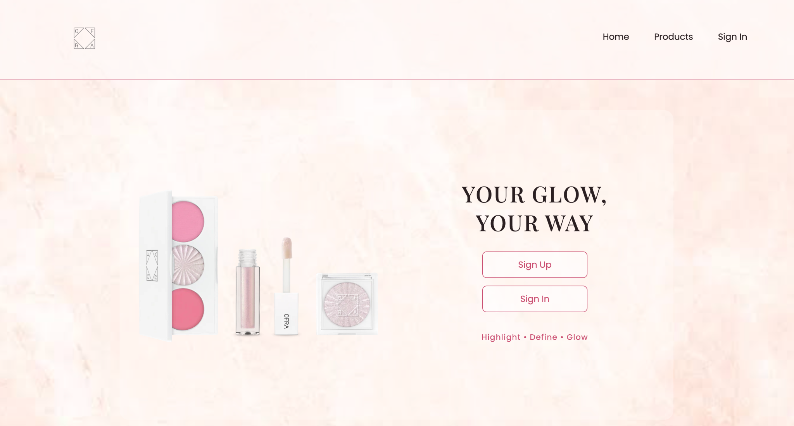
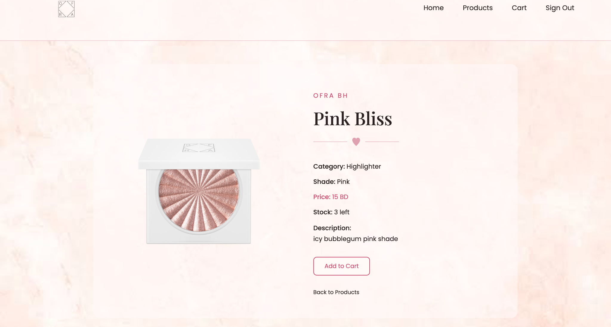
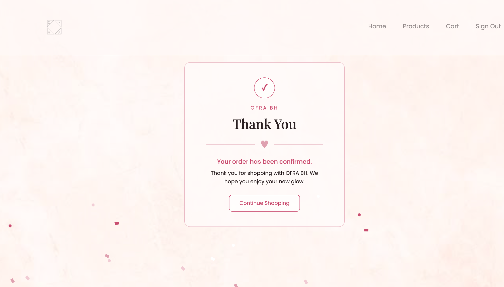

# OFRA BH

## Description

OFRA BH is a MEN Stack web application for browsing and managing beauty products.

Users can browse products by category, view product details, add products to their cart, remove products from their cart, and confirm their orders.

Admin users can add, edit, update, and delete products.

The app uses authentication, full CRUD functionality, RESTful routes, user roles, cart functionality, stock management, and relationships between the User and Product models.

## User Stories

- As a user, I want to visit the homepage and understand the website.
- As a user, I want to sign up and create an account.
- As a user, I want to sign in to use the website.
- As a user, I want to browse products by category.
- As a user, I want to view the details of a product.
- As a user, I want to add products to my cart.
- As a user, I want to remove products from my cart.
- As a user, I want to confirm my order.
- As a user, I want the product stock to update after checkout.
- As a user, I want to sign out when I am finished.
- As an admin, I want to add new products.
- As an admin, I want to edit products.
- As an admin, I want to delete products.

## Wireframes

The wireframes show the planned layout for:

- Home page
- Products page
- Product details page
- Add product page
- Edit product page
- Sign-up page
- Sign-in page

## ERD

The app has two main models: User and Product.

### User

- `_id`
- `username`
- `password`
- `isAdmin`
- `cart`

### Product

- `_id`
- `name`
- `category`
- `shade`
- `price`
- `description`
- `image`
- `stock`
- `owner`

### Relationship

- One User can be related to many Products.
- Each Product contains an `owner` reference to a User.
- The User cart stores references to Product documents.
- `populate()` is used when the full product information is needed from the cart.

## RESTful Routes

### Product Routes

| Action | Route | HTTP Verb |
| ------ | ----- | --------- |
| Index | `/products` | GET |
| Categories | `/products/categories` | GET |
| Category | `/products/category/:categoryName` | GET |
| New | `/products/new` | GET |
| Create | `/products` | POST |
| Show | `/products/:productId` | GET |
| Edit | `/products/:productId/edit` | GET |
| Update | `/products/:productId` | PUT |
| Delete | `/products/:productId` | DELETE |

### Cart Routes

| Action | Route | HTTP Verb |
| ------ | ----- | --------- |
| View Cart | `/cart` | GET |
| Add to Cart | `/cart/:productId` | POST |
| Remove from Cart | `/cart/:productId` | DELETE |
| Checkout | `/cart/checkout` | POST |

## Getting Started

## Deployed App

[View OFRA BH](https://ofra-bh.onrender.com/)

To use the app:

- Open the homepage.
- Browse products by category.
- Click a product to view its details.
- Sign up or sign in.
- Add products to the cart.
- Remove products from the cart if needed.
- Confirm the order.
- Product stock updates after checkout.
- Admin users can add, edit, update, and delete products.
- Sign out when finished.

## Screenshots

### Home Page

### Shop by Category

### Product Details

### Order Confirmation

## Technologies Used

- MEN Stack
  - MongoDB
  - Express.js
  - Node.js
- Mongoose
- EJS
- HTML
- CSS
- JavaScript
- Express Session
- bcrypt
- Method Override

## Attributions

- All product images and visual assets used in this project were sourced from the official [OFRA Cosmetics](https://www.ofracosmetics.com/) website and are used for educational purposes only.
- Fonts were sourced from [Google Fonts](https://fonts.google.com/).
- The project was built using the General Assembly MEN Stack Session Authentication starter template.

## Future Work

- Add product search.
- Add product quantities to the cart.
- Add available and sold-out status.
- Add an online payment option.
- Add order history for customers.